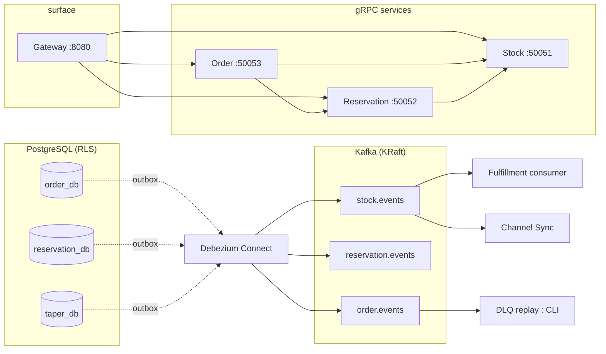

<div align="center">

# Taper

**Multi-tenant distributed inventory management system**

[](https://go.dev)
[](https://github.com/seifsheikhelarab/taper/actions)

[Overview](#overview) • [Features](#features) • [Architecture](#architecture) • [Getting started](#getting-started) • [Testing](#testing) • [Repository layout](#repository-layout) • [Documentation](#documentation)

</div>

Taper is a high-performance, multi-tenant inventory system for stock tracking, reservation, order fulfillment, and multi-channel sync across warehouses. It balances **strong consistency** on the stock reservation hot path (no overselling under high concurrency) with **eventual consistency** for downstream workflows — built on gRPC, PostgreSQL Row-Level Security, the transactional outbox pattern, Debezium CDC, and Kafka.

> [!NOTE]
> This is a reference implementation developed in phases: core reservation/order saga (P1–3), REST gateway (P4), and observability, load testing, chaos testing and containerization (P5). It is designed to be read, operated, and stress-tested — not bolted onto a production stack as-is.

## Overview

Stock management in multi-tenant e-commerce faces two hard problems:

1. **No overselling under flash-sale concurrency.** Naive `read → check → write` races oversell stock. Taper serializes every stock mutation behind a PostgreSQL `SELECT ... FOR UPDATE` row lock and commits the state change together with an immutable audit event.
2. **No dual-write inconsistencies.** Writing to both a database and a message queue in application code leaves a partial-failure window. Taper writes domain events to a transactional **outbox** table in the same transaction as the state change; Debezium streams them from the Postgres WAL into Kafka.

## Features

- **Zero-oversell reservations** — per-SKU, per-warehouse row-locked writes (`stock_levels`) with a synchronous audit event log (`stock_events`) in the same transaction. Sub-100ms p99 reservation checks via the REST gateway.
- **Multi-tenant isolation at the engine level** — shared tables guarded by PostgreSQL Row-Level Security; the gateway injects the `tenant_id` from a verified JWT and rejects bodies naming a different tenant.
- **Orchestrated order saga** — the order service coordinates Reservation → Payment → Stock with explicit compensation (`PENDING_PAYMENT → RESERVED → ALLOCATED → CONFIRMED`, or `COMPENSATED` / `FAILED`).
- **Transactional outbox + Debezium CDC** — one Kafka topic per service (`*.events`), with per-SKU/per-order ordering via composite partition keys.
- **Fail-fast circuit breakers** — per-dependency breakers at the gateway return `503` immediately instead of queuing against a degraded downstream.
- **Idempotency** — `processed_idempotency_keys` records make saga steps and reservations exactly-once, including crash recovery (`SAGA_RESUME_ENABLED`) and an independent reservation-TTL sweeper.
- **Audit locks & reconciliation** — RLS-scoped stock drift is detected by a reconciliation scan; suspect SKUs are locked (`is_locked_for_audit`) until cleared via the `UnlockStockForAudit` admin endpoint.
- **Dead-letter queue + replay** — a standardized `pkg/streaming` DLQ envelope plus a `cmd/dlqreplay` CLI to recover failed Kafka messages.
- **External channel sync** — stock adjustments from Shopify/WooCommerce, clamped at zero with an urgent deficit alert.
- **End-to-end observability** — W3C `traceparent` propagated across gRPC, Kafka (via the outbox column → Debezium header), and DLQ replay; Prometheus RED metrics + breaker state on admin ports; Jaeger UI.
- **Outbox pruning** — advisory-locked background worker (`pkg/outboxprune`) so retention never interferes with CDC streaming.

## Architecture

Five gRPC services, a REST gateway, and a Kafka consumer — each service owns its database and its outbox, all wired to a single Postgres instance via Debezium:



Services, from the outside in:

| Service | Entry point | Role |
|---|---|---|
| **Gateway** | `cmd/gateway` | REST front: JWT auth, per-tenant rate limiting, tenant injection, fail-fast error mapping |
| **Order** | `cmd/order` | Saga orchestrator (`CreateOrder` / `CancelOrder` / `FulfillOrder`) |
| **Reservation** | `cmd/reservation` | Reservation lifecycle + background TTL sweeper |
| **Stock** | `cmd/stock` | `stock_levels` writes, `stock_events` audit log, allocations, audit locking |
| **Fulfillment** | `cmd/fulfillment` | Kafka consumer driving pick tickets and dispatch on `order.confirmed` |
| **Channelsync** | `cmd/channelsync` | External channel stock sync, clamped at zero |
| **DLQ replay** | `cmd/dlqreplay` | CLI to re-inject DLQ messages into main topics |

### The no-oversell write path

Every stock mutation runs in one transaction:

```sql
SELECT available_qty FROM stock_levels
WHERE tenant_id = $1 AND sku_id = $2 AND warehouse_id = $3
FOR UPDATE;              -- serialize concurrent reservations on this row

-- available_qty >= qty ? adjust counts, append stock_events row += outbox row
```

The chargeable movement `available − qty` happens against the locked row, then the audit event and outbox record are inserted in the *same* transaction — so oversell is impossible and no event is ever orphaned.

## Getting started

### Prerequisites

- Go 1.26+
- Docker & Docker Compose
- (optional) [buf](https://buf.build) for regenerating protobuf code, [k6](https://grafana.com/docs/k6/latest/set-up/install-k6/) for load testing

### 1. Start the infrastructure

```bash
docker compose up -d --wait postgres kafka connect connect-init jaeger
```

This brings up Postgres (with Debezium's logical-decoding plugins), Kafka in KRaft mode, Debezium Connect with the outbox connectors registered, and Jaeger for traces (`http://localhost:16686`).

> [!IMPORTANT]
> Migrations must run **before** connector registration — the connectors snapshot `public.outbox` at startup. `connect-init` registers them after Connect is healthy; if you started the stack without it, run `docker compose run --rm connect-init` once migrations are applied.

### 2. Apply migrations

```bash
docker compose exec -T postgres pg_isready -U postgres
# one DB per service: taper_db, reservation_db, order_db, channelsync_db
for f in db/migrations/stock/*.up.sql; do
  docker compose exec -T postgres psql -v ON_ERROR_STOP=1 -U postgres -d taper_db < "$f"
done
# repeat for reservation / order / channelsync against their DBs
```

### 3. Run the services

```bash
go run ./cmd/stock
go run ./cmd/reservation
go run ./cmd/order
go run ./cmd/fulfillment   # optional: consumes order.confirmed → CONFIRMED
go run ./cmd/gateway       # REST surface :8080
```

Sanity check:

```bash
curl -s http://localhost:8080/healthz
```

Every request path (except `/healthz`) requires a `Bearer` token carrying a `tenant_id` claim — the load harness in `load/lib.js` shows how to mint sandbox tokens (`scripts/run-load.sh` runs the whole stack, seeds SKUs, drives k6, and audits the no-oversell invariant).

### Containerized services (optional)

A `containers` compose profile builds all five binaries as ~2 MiB distroless images:

```bash
docker compose --profile containers up -d --build
```

Only the gateway publishes a host port (`8080`); internal gRPC and metrics ports stay network-internal. Scale a service with `--scale` — inbound gRPC dials use client-side `round_robin` (`pkg/grpcx`), so replicas share traffic without a proxy hop.

## Testing

| Layer | Command | Notes |
|---|---|---|
| Unit | `go test ./pkg/...` | Also `go vet ./...` + `gofmt -l .` in CI |
| Integration | `go test ./integration/` | Needs the compose stack up (runs in CI against the exact `docker-compose.yml` stack) |
| Chaos | `CHAOS=1 go test -run TestChaos ./integration/ -timeout 12m` | Kills real service processes mid-saga; asserts `available + allocated == seeded` |
| Load | `scripts/run-load.sh [reserve\|saga\|both] [rate] [duration]` | k6 against the gateway; `scripts/audit-oversell.sql` asserts the invariant after the run |
| Infra restarts | `scripts/chaos/kafka-restart.sh` / `postgres-restart.sh` | Broker/DB bounces under live traffic |

A representative result from the reserve scenario (spread across 50 SKUs, low-hundreds rps, audit passed) is recorded in [`docs/runbooks/load.md`](docs/runbooks/load.md).

## Repository layout

```
cmd/            Service entry points (stock, reservation, order, fulfillment, channelsync, gateway, dlqreplay)
internal/       Service-private domain logic and gRPC implementations
pkg/            Reusable packages: database (RLS), streaming (Kafka+DLQ), circuitbreaker,
                outboxprune, ratelimit, auth, observability, grpcx, channel, payment
proto/          Protobuf schemas (order, reservation, stock) — buf-generated code in gen/
db/             init SQL, per-service migrations, sqlc queries, Debezium connector configs
integration/    End-to-end Go test suites (saga, RLS, CDC, gateway, tracing, chaos)
load/           k6 load scenarios and helpers
scripts/        Load/chaos runners and the oversell audit SQL
docs/           ADRs, research notes, and operational runbooks
```

## Documentation

- [`CONTEXT.md`](CONTEXT.md) — domain vocabulary and invariants (stock states, saga, idempotency, trace context)
- [`docs/adr/`](docs/adr) — Architecture Decision Records (RLS multi-tenancy, outbox+CDC, outbox read contract)
- [`docs/runbooks/`](docs/runbooks) — observability, load-testing, and chaos runbooks
- [`docs/research/`](docs/research) — gateway HTTP layer and service-containerization findings